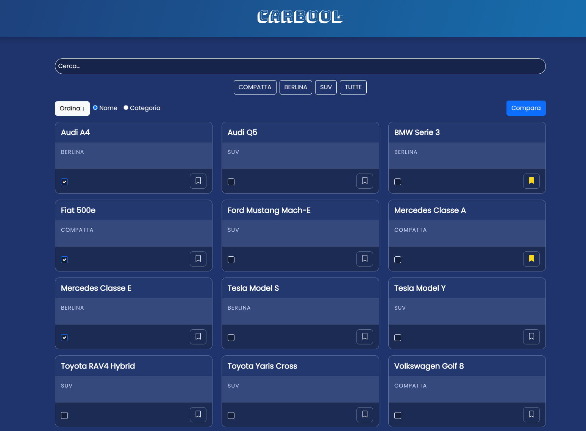
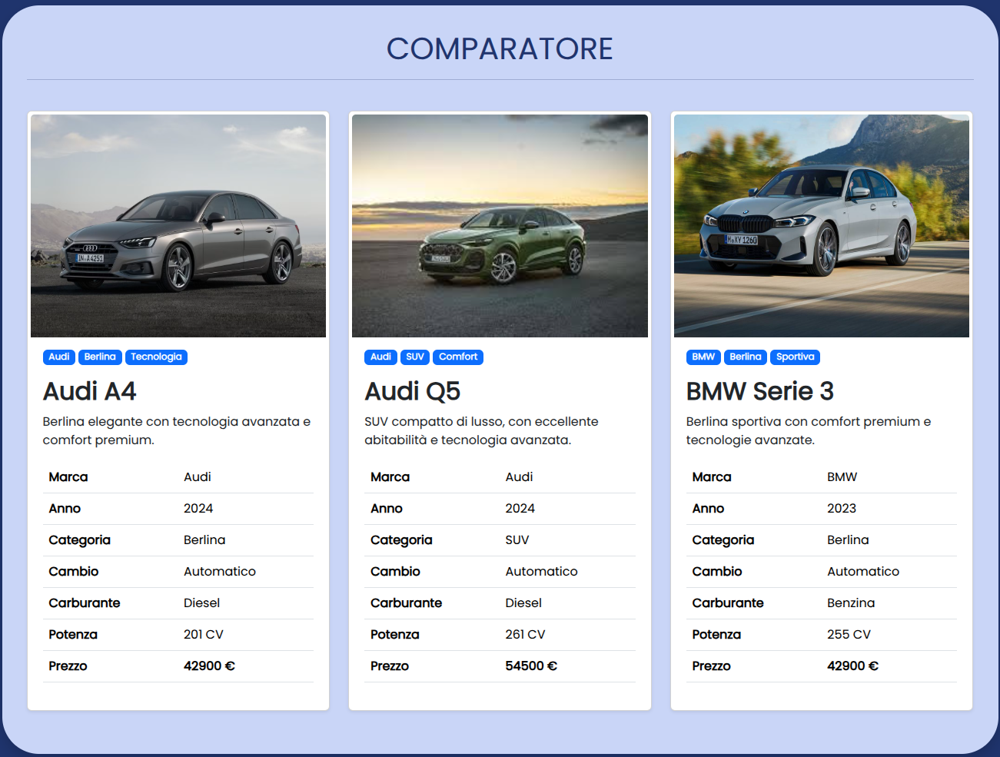
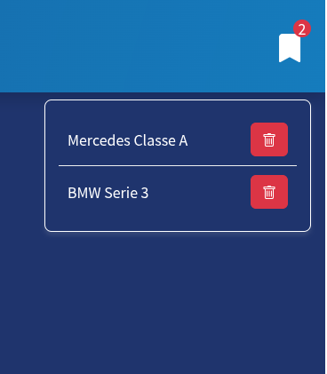

  
# PROGETTO PRATICO COMPARATORE DI RECORD

**SPA** che simula l’esperienza di un utente non autenticato, che può:
  - Sfogliare, cercare e filtrare record
  - Confrontare più elementi tra loro
  - Salvare i preferiti


Progetto sviluppato con **React** in JavaScript

### Librerie esterne utilizzate
 - Bootstrap per lo stile
 - FountSource per i font


## Funzionalità principali

1. Gestione di una risorsa definita in types.ts (la cartella */database* del backend, contenente i file `.json` generati per la risorsa)

2. **Homepage**
    - Lista dei record, che mostra solo le proprietà principali title e category, e include:
    - Barra di ricerca per cercare nei titoli (title), implementato **debounce** per migliorare la UX ed evitare chiamate API inutili
    - Filtro per categoria (category)
    - Ordinamento alfabetico per title o category (A-Z e Z-A)


3. **Pagina di dettaglio** per ogni record, con visualizzazione estesa delle sue proprietà (es. price, description, brand, ecc.)

4. **Comparatore di 2 o più record**  visualizzati affiancati per confrontarne le caratteristiche.
   

5. **Sistema di preferiti** sempre accessibile e aggiornabile:
    - L’utente può aggiungere o rimuovere record dai preferiti in qualsiasi momento
    - I preferiti sono consultabili in ogni sezione dell’app tramite componente dedicato
    - salvataggio in `localStorage` per mantenere la persistenza del dato
    

6. **Gestione degli stati vuoti** come:
    - Nessun risultato trovato
    - Lista preferiti vuota
    - Nessun elemento selezionato nel comparatore
    - Pagina 404


    ## Architettura dei componenti

    ### Componenti principali

    - **App**: Componente root con routing e gestione dello stato globale
    - **HomePage**: Lista dei record con ricerca, filtri e ordinamento
    - **ProductDetail**: Visualizzazione dettagliata di un singolo record
    - **ComparatorCard**: Confronto affiancato di più record selezionati
    - **Favorites**: Gestione e visualizzazione dei record preferiti
    - **SearchBar**: Barra di ricerca con debounce implementato
    - **FilterControls**: Controlli per filtro categoria e ordinamento
    - **CarCard**: Card riutilizzabile per la visualizzazione dei record


    ### Struttura delle cartelle

    ```
    database/     #file .json generati per la risorsa
    |
    src/
    ├── components/     # Componenti riutilizzabili
    ├── pages/         # Pagine principali dell'app
    ├── types/         # Definizioni TypeScript
    └── utils/         # Funzioni di utilità
    ```
